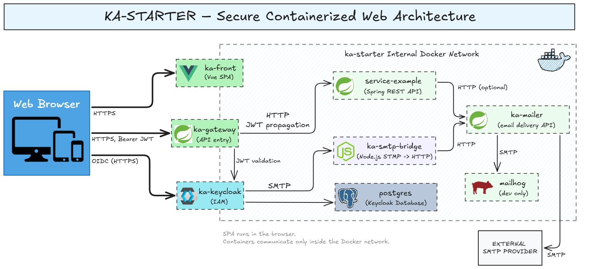

# ka-starter

A minimal, production-oriented infrastructure starter  
(Vue 3 + Spring Boot + Keycloak + Docker)

Clone → configure → deploy.

---

## Why ka-starter

Every new project tends to start the same way:
- authentication
- API gateway
- environment configuration
- Docker setup
- production deployment

ka-starter extracts this recurring infrastructure into a reusable,
production-oriented starter, so you can focus on your actual product.

---

## Architecture

ka-starter is built around a simple, Docker-first architecture
designed to run both locally and on a single VPS.



### Services Overview

| Service       | Technology   | Description                            |
|---------------|--------------|----------------------------------------|
| Frontend      | Vue 3 + Vite | SPA frontend                           |
| Gateway       | Spring Boot  | API Gateway (single entry point)       |
| Backend       | Spring Boot  | REST API and business logic            |
| Keycloak      | Keycloak     | Identity & access management (IAM)     |
| PostgreSQL    | PostgreSQL  | Keycloak database                     |
| SMTP Bridge   | Node.js      | SMTP → HTTP bridge for Keycloak emails |
| Mailer        | Spring Boot  | Email delivery service (HTTP API)      |
| MailHog (dev) | MailHog      | Development mailbox UI                |

---

## Quick start (production-style)

### host.docker.internal (Linux users)

This project may rely on `host.docker.internal` for container → host communication.
On Linux, you must add it manually:
```bash
sudo sh -c 'echo "172.17.0.1 host.docker.internal" >> /etc/hosts'
````

### Deployment

#### Initial deployment
```bash
git clone https://github.com/franzk/ka-starter.git
cd ka-starter
cp .env.example .env
# edit .env
./deploy/scripts/deploy.sh init
```

This will:
- build all services
- start the full stack with Docker
- optionally integrate with an existing reverse proxy

This setup follows a real-world, production-first deployment model on a single VPS.

#### Subsequent deployments
```bash
./deploy/scripts/deploy.sh update
```

---
### CI/CD (GitHub Actions, update only)
Required secrets:

| Secret          | Description         |
| --------------- | ------------------- |
| `SSH_HOST`      | Server address      |
| `SSH_USER`      | SSH user            |
| `SSH_KEY`       | SSH private key     |
| `SSH_HOST_PATH` | Project path on VPS |


GitHub Actions are intentionally limited to update deployments.
Initial deployment must be done manually.
Update deployments can be triggered manually from the GitHub Actions tab by running the Deploy ka-starter (update) workflow.

---
## Local development
Local development can be run service-by-service:

- Infrastructure (Keycloak, DB, MailHog):
```bash
cd dev && docker compose up
```

- Frontend:

```bash
cd ka-front
pnpm install
pnpm dev
```
- Gateway / Backend / Mailer:
```bash
./gradlew bootRun
```

---
## Scope
ka-starter is not a project template or a turnkey SaaS.

It focuses on:
- OAuth2 / OIDC authentication with Keycloak
- Token-based API security
- Clean service separation
- Production-ready Docker setup

It is intended as a solid technical foundation,
not as a finished product.

---
## Contributing
1. Fork the repository
2. Create a feature branch
3. Commit clean, atomic changes
4. Open a Pull Request

---
## Support
Issues: https://github.com/franzk/ka-starter/issues